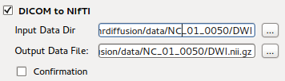
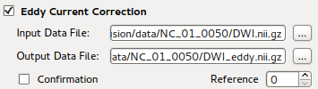
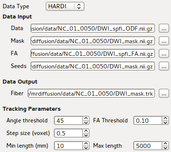
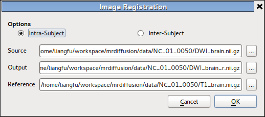
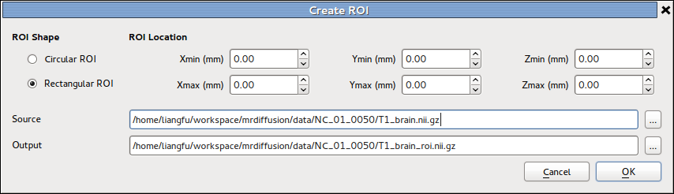
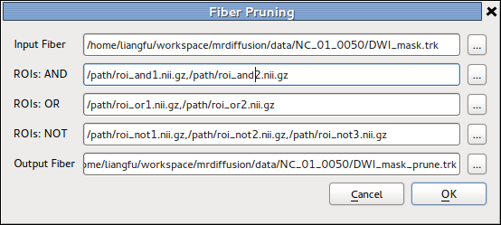

.. diffusionkit documentation master file, created by
   sphinx-quickstart on Mon Oct 26 10:48:55 2015.
   You can adapt this file completely to your liking, but it should at least
   contain the root `toctree` directive.

.. meta::
   :description: Tutorial on DiffusionKit

.. toctree::
   :maxdepth: 3

-----------------------------------------
GUI Fornt-end of Data Processing Pipeline
-----------------------------------------

Preprocessing
=============

A 'Confirmation' option is provided in each of the following preprocessing step.
When confirmation is required, the program displays the processing result 
after the target file is generated to ensure the correctness the final result.

DICOM to NIFTI Conversion
-------------------------

This is the GUI front end for :code:`dcm2nii` program. Details can be found at 
:ref:`DICOM_to_NIFTI` section.

Eddy Current Correction
-----------------------

This is the GUI front end for :code:`bneddy` program. Details can be found at 
:ref:`Eddy_Current_Correction` section.

Since this is a time-consuming step in preprocessing stage, one can skip
this step ignoring potential image registration error in original DWI data
by unchecking the option. Then the converted NIFTI image would be input of 
brain extraction tool directly if the skull stripping option is enabled.

.. _Skull_Stripping:

Skull Stripping
---------------

FSL's `BET (Brain Extraction Tool) <http://fsl.fmrib.ox.ac.uk/fsl/fslwiki/BET>`_ is
integrated as part of the program, so that one can verify automatic skull stripping result 
by visualizing overlaying mask image upon original image.
See :ref:`Volume_Image_Overlay` on how to generate overlaid background images.

.. figure:: images/gui_bnstrip.png
  :align: center

A threshold value that indicate 'fractional intensity' is exposed on the GUI,
so that one can adjust the threshold to get smaller/larger brain outline estimates.
Details on the implement can be found at 
`BET's UserGuide <http://fsl.fmrib.ox.ac.uk/fsl/fslwiki/BET/UserGuide>`_.

Diffusion Model Reconstruction
==============================

Starting from this section, we provide three different approaches for diffusion MR data processing:

This is the GUI front end for :ref:`Reconstruction`, which generates required model for 
:ref:`Fiber_Tracking` from DWI image and related b-values.
				 
.. toggle_table::
  :arg1: DTI
  :arg2: SPFI
  :arg3: CSD

Click one of the options above to see guidelines on using the specific method for data processing.

.. toggle:: DTI

 .. figure:: images/gui_recon_dti.png
   :align: center

   GUI front-end for :ref:`DTI_Reconstruction` using :code:`bndti_estimate`

.. toggle:: SPFI

 .. figure:: images/gui_recon_spfi.png
   :align: center

   GUI front-end for :ref:`SPFI_Reconstruction` using :code:`bnhardi_ODF_estimate`

.. toggle:: CSD

 .. figure:: images/gui_recon_csd.png
   :align: center

   GUI front-end for :ref:`CSD_Reconstruction` using :code:`bnhardi_FOD_estimate`

Once DWI data is selected through file selection dialog, all other input and output 
options would be automatically generated. 
This simplifies the usage of command-line program, which requires a list of options to be entered.

Fiber Tracking
==============

To generate fiber tracking result using previously generated diffusion model,
we provide the GUI front-end for using :code:`bndti_tracking` and :code:`bnhardi_tracking`, 
which generate tract files from DTI and HARDI respectively.
The details of the program are described on :ref:`Fiber_Tracking` section.

Fiber tracking require seed(ROI) files to initialize a tracking process.
One can either generate the seed files from the **Registration Tool** we provided from
**Tools** menu, or split a brain atlas image (e.g. AAL) using :code:`bncalc` or :code:`bnroisplit`
into multiple ROI files.
To generate whole brain fiber, just use the brain mask image generated during :ref:`Skull_Stripping`
as seed input. This may cost a few minutes when HARDI is used as input diffusion model.

Miscellaneous Tools
===================

Image Registration
------------------

This is basically the GUI front-end of NiftyReg, while we perform :code:`reg_aladin` 
on intra-subject images, and addtionally run :code:`reg_f3d` for inter-subject cases.

The details of the tool is described in 
`Image Registration <userguide.html#image-registration>`_ section in UserGuide page.

Create ROI
----------

The details of the tool is described in `Image calculation and ROI generation <userguide.html#image-calculation-and-roi-generation>`_ section in UserGuide page.

Fiber Pruning
-------------

The details of the tool is described in `Fiber manipulation <userguide.html#fiber-manipulation>`_ section in UserGuide page.

.. include:: common.txt
