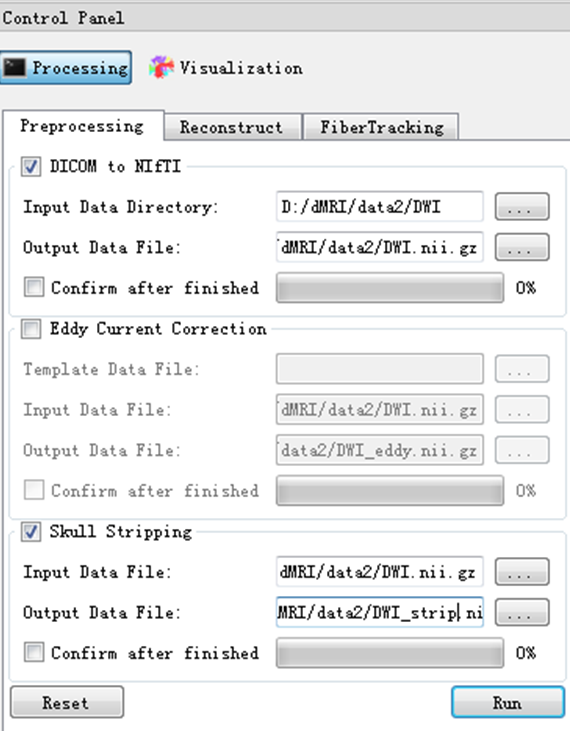

.. mrdiffusion documentation master file, created by
   sphinx-quickstart on Mon Oct 26 10:48:55 2015.
   You can adapt this file completely to your liking, but it should at least
   contain the root `toctree` directive.

--------
Overview
--------

.. meta::
   :description: Overivew of MR.Diffusion

.. toctree::
   :maxdepth: 3
   :local:

.. raw:: html

 
 

MR. Diffusion is a light one-stop cross-platform solution to dMRI data analysis. The package delivers a complete pipeline from data format conversion to preprocessing, from local reconstruction to fiber tracking, and from fiber statistics to visualization. MR. Diffusion was developed as a cross-platform framework, using ITK [1]_ for computation, VTK [2]_ for visualization, and Qt for GUI design. Both GPU and CPU computing were implemented for visualization to achieve high frame-rate, for rendering complex scene like whole brain tractographs in particular. The project was managed using the compiler-independent CMake [3]_, which is compatible with gcc/g++ and MS Visual Studio, etc. Well-established algorithms, such as the DICOM conversion tool dcm2nii by Chris Rorden [4]_ and the constrained spherical deconvolution (CSD) for HARDI reconstruction in MRtrix [5]_, were adopted with improved interface and user experience.

System requirement
==================

Basically this software can run in any system, including 32/64-bit MS Windows/Linux OS, although currently we only tested and released the binary packages for Windows/Linux OS. The software is developed based on C/C++, and some platform independent packages, including ITK, VTK, and OpenCV, etc. However, for high-performance data processing and visualization, we recommend using 64-bit OS with multi-core CPU and standalone video card.

Install/Uninstall
=================

Please download the package from http://brainnetome.org/en/brat-dMRI , according to your own OS. Unpack the files to where you want and you can enjoy the software. The 64-bit OS is recommended for high-performance data processing. Each installation package is completely standalone so you DO NOT need to install ANY other dependency to run the software. If you encounter any dependency problem please DO `contact us <mailto:mr.diffusion@nlpr.ia.ac.cn>`_.

For MS Windows OS
-----------------

Double click the ``MRDiffusionSetup-vxxx.exe`` file and then choose the destination path according to the wizard. You may need to provide administrator permission if you want to put the files into the system path. Similarly, to uninstall you only need to hit the menu of “uninstall” in the MS Windows start menu.

For Linux OS
------------

:code:`Glibc>=2.2` is required. Download the ``MRDiffusionSetup-vxxx.tar.gz``, and then

.. code-block:: bash

 tar zxvf mrdiffusion.tar.gz 
 cd mrdiffusion
 ./xxxx (you can run the command in this way)

If you do not want to type the full path every time, you could add the path to the $PATH. Edit the ~/.bashrc file, then add the following line,

.. code-block:: bash

 export $PATH=$PATH:/your/path/to/mrdiffusion

To uninstall the software, just manually remove the entire folder where you untar-ed the .tar.gz file.

That’s it! Enjoy the software now!

Key functions of the software
=============================

.. figure:: images/overall.png
   :width: 800 px
   :alt: The overall design framework of MR. Diffusion
   :align: center

   Figure 1. The overall design framework of MR. Diffusion.

.. figure:: images/mainwindow.png
   :width: 800 px
   :alt: The main window of the software
   :align: center

   Figure 2. The main window of the software.

It should be noteworthy that, for all the computing steps provided in GUI, the called commands with the complete parameter list are displayed in a separate log window. Such a design is special for the users to keep in mind what he/she is doing, and furthermore, it could be directly copied into script (Bash, Python …) for batch processing.
Preprocessing

   Figure 3. Data preprocessing steps, including data format conversion, eddy current correction and brain extraction.

DICOM to NIFTI as unified data format

For saving space of data store, the nii.gz format was used throughout the whole pipeline. Firstly, we use the dcm2nii (by Chris Rorden, https://www.nitrc.org/projects/dcm2nii) to convert the data into a single 3/4D .nii.gz volume-series file, plus bval and bvec files. The format of bval file is ::

 0 1500 1500 …… 1500

and the format of bvec file is ::

 0  0.99944484233856   0.00215385644697   0.00269041745923 ...
 0  -0.0053533311002   0.99836695194244   0.60518479347229 ...
 0  0.03288444131613  -0.05708565562963   -0.79608047008514 ...

where the 0 in the first column indicates the b0 images in the scan and certainly the software also supports multi-b0 images. Since the DICOM formats from different scanner might be different, this function is not always able to successfully extract the bvec/bval files. If you encounter such a problem, please get back to us <link> and give the link of your data if it has big size beyond the email capability. 

.. code-block:: bash

 ccm@:bin$ ./dcm2nii -h
 Compression will be faster with /usr/local/bin/pigz
 Chris Rorden's dcm2niiX version 24Nov2014
 usage: dcm2nii [options] <in_folder>
  Options :
   -h : show help
   -f : filename (%c=comments %f=folder name %p=protocol %i ID of patient %n=name of patient %s=series, %t=time; default 'DTI')
   -o : output directory (omit to save to input folder)
   -z : gz compress images (y/n, default n)
 Defaults file : /home/ccm/.dcm2nii.ini
 Examples :
  dcm2nii /Users/chris/dir
  dcm2nii -o /users/cr/outdir/ -z y ~/dicomdir
  dcm2nii -f mystudy%s ~/dicomdir
  dcm2nii -o "~/dir with spaces/dir" ~/dicomdir
 Example output filename: '/DTI.nii.gz'

