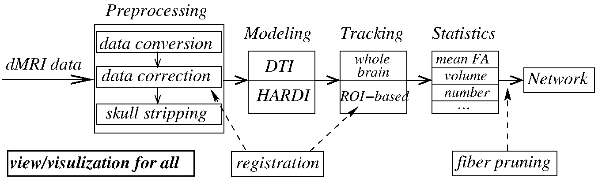
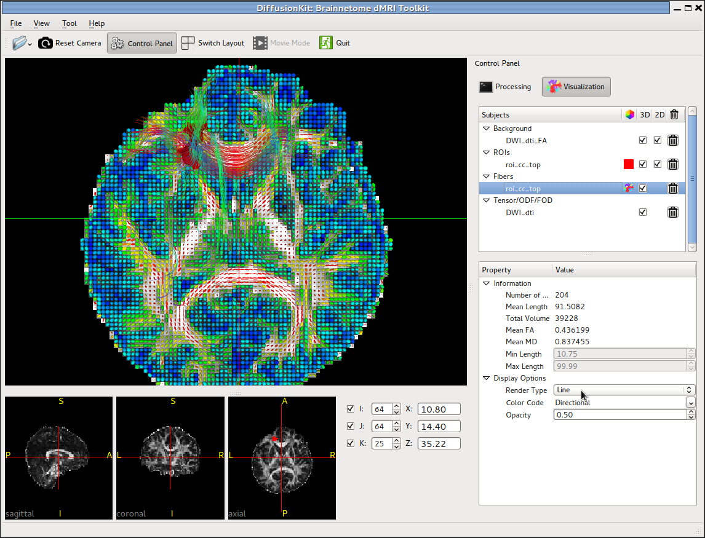

.. diffusionkit documentation master file, created by
   sphinx-quickstart on Mon Oct 26 10:48:55 2015.
   You can adapt this file completely to your liking, but it should at least
   contain the root `toctree` directive.

--------
Overivew
--------

.. meta::
   :description: Overivew of Brainnetome DiffusionKit

.. toctree::
   :maxdepth: 3

Brainnetome DiffusionKit is a light one-stop cross-platform solution to dMRI data analysis. 
The package delivers a complete pipeline from data format conversion to preprocessing, 
from local reconstruction to fiber tracking, and from fiber statistics to visualization. 
DiffusionKit was developed as a cross-platform framework, using 
ITK `[1] <reference.html#id1>`_ for computation, 
VTK `[2] <reference.html#id2>`_ for visualization, and Qt for GUI design. 
Both GPU and CPU computing were implemented for visualization to achieve high frame-rate, 
for rendering complex scene like whole brain tractographs in particular. 
The project was managed using the compiler-independent CMake `[3] <reference.html#id3>`_, 
which is compatible with gcc/g++ and MS Visual Studio, etc. Well-established algorithms, 
such as the DICOM conversion tool dcm2nii by Chris Rorden 
`[4] <reference.html#id4>`_ and the constrained spherical deconvolution (CSD) for 
HARDI reconstruction in MRtrix `[5] <reference.html#id5>`_, were adopted with 
improved interface and user experience.

Key functions of the software
=============================

+------------+----------------------+-------------------------------------------------------+
| Functions  | Program              | Description (use '-h' argument for more details)      |
+============+======================+=======================================================+
| Preprocess | dcm2nii              | Convert DICOM to unified 4D NIFTI files               |
|            +----------------------+-------------------------------------------------------+
|            | bneddy               | Reduce head motion and magnetic artifacts             |
|            +----------------------+-------------------------------------------------------+
|            | bet2                 | Extract brain tissue (Smith, 2002)                    |
|            +----------------------+-------------------------------------------------------+
|            | bnsplit,bnmerge      | Split/merge the 4D image along the 4th dimension      |
+------------+----------------------+-------------------------------------------------------+
| Modeling   | bndti_estimate       | Estimate tensor model, output FA, MD, tensor etc.     |
|            +----------------------+-------------------------------------------------------+
|            | bnhardi_ODF_estimate | Estimate ODF by SPFI method                           |
|            +----------------------+-------------------------------------------------------+
|            | bnhardi_FOD_estimate | Estimate FOD by CSD method (Tournier et al., 2007)    |
+------------+----------------------+-------------------------------------------------------+
| Tracking   | bndti_tracking       | Track white matter fiber based on tensor model        |
|            +----------------------+-------------------------------------------------------+
|            | bnhardi_tracking     | Track white matter fiber based on ODF/FOD             |
+------------+----------------------+-------------------------------------------------------+
| Visualize  | bnviewer             | Visualize various kinds of data (.nii.gz, .trk)       |
+------------+----------------------+-------------------------------------------------------+
| Tools      | bncalc,bnroisplit    | Numeric calculation and ROI generation                |
|            +----------------------+-------------------------------------------------------+
|            | bninfo               | Show the head information of DICOM and NIFTI files    |
|            +----------------------+-------------------------------------------------------+
|            | reg_aladin,reg_f3d   | Inter/intra-image registration across modalities      |
|            +----------------------+-------------------------------------------------------+
|            | reg_resample,        | Resample and apply transformation matrix              |
|            | reg_transform        |                                                       |
|            +----------------------+-------------------------------------------------------+
|            | bnfiber_end,         | Prune fiber bundle, logical and/or/not based on ROIs  |
|            | bnfiber_prune        |                                                       |
|            +----------------------+-------------------------------------------------------+
|            | bnfiber_stats        | Export attributes of fiber bundles                    |
|            +----------------------+-------------------------------------------------------+
|            | bnfiber_map          | Generate the fiber density going through each voxel   |
|            +----------------------+-------------------------------------------------------+
|            | bnnetwork            | Function to construct anatomical network              |
+------------+----------------------+-------------------------------------------------------+

   Figure 1. The overall design framework of DiffusionKit

   Figure 2. The main window of the software.

It should be noteworthy that, for all the computing steps provided in GUI, the called commands with the complete parameter list are displayed in a separate log window. Such a design is special for the users to keep in mind what he/she is doing, and furthermore, it could be directly copied into script (Bash, Python ...) for batch processing.

.. include:: common.txt

