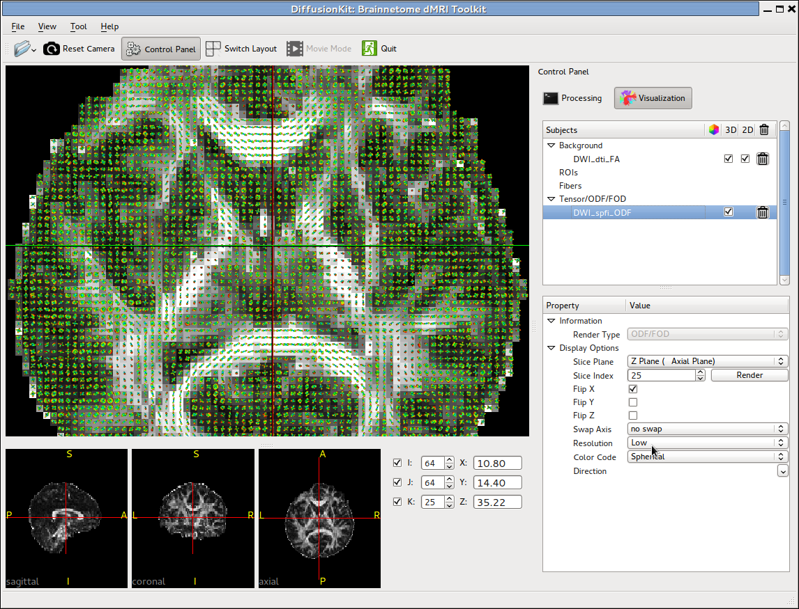
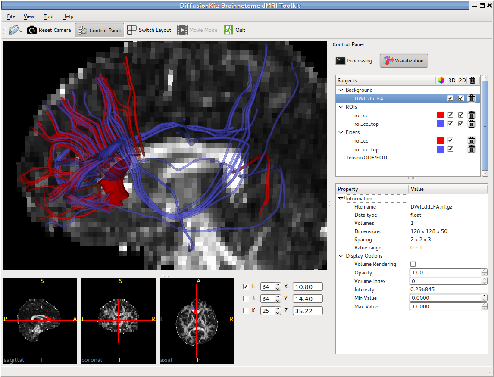
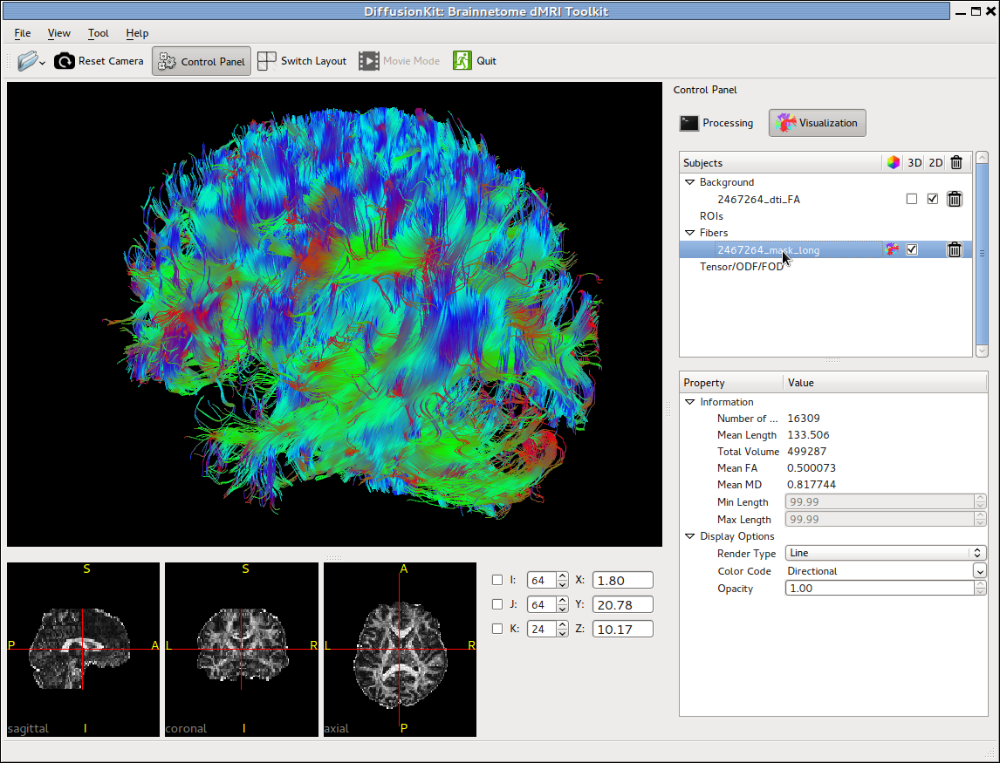

.. mrdiffusion documentation master file, created by
   sphinx-quickstart on Mon Oct 26 10:48:55 2015.
   You can adapt this file completely to your liking, but it should at least
   contain the root `toctree` directive.

===========
Screenshots
===========

Linux
=====

|sticks| |slices|

|4A| |mainwindow| 

|fibers| |fibers2|

.. |mainwindow| image:: images/mainwindow.png
   :width: 320

.. |sticks| image:: images/sticks.png
   :width: 300

.. |slices| image:: images/slices.png
   :width: 310

.. include:: common.txt

Windows
=======

