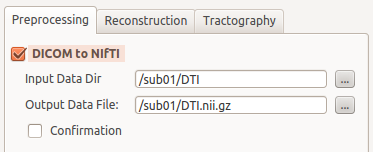
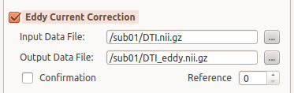
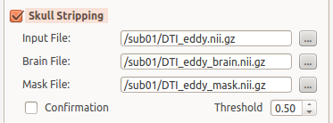
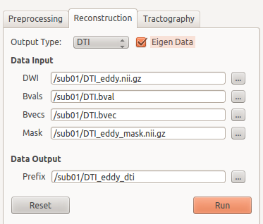
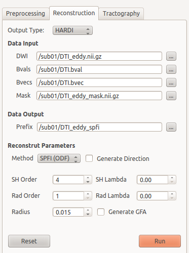
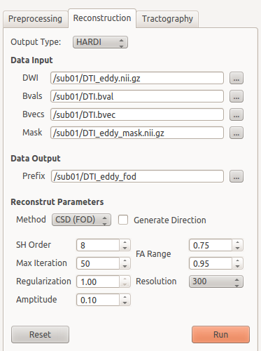
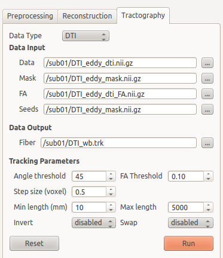
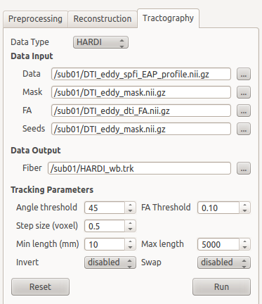

.. diffusionkit documentation master file, created by
   sphinx-quickstart on Mon Oct 26 10:48:55 2015.
   You can adapt this file completely to your liking, but it should at least
   contain the root `toctree` directive.

.. meta::
   :description: Tutorial on Diffusion Kit

.. toctree::
   :maxdepth: 3

Programming in Bash/Python
==========================

If you want to use script for batch processing, we strongly recommend using Python, 
since it has nice grammar style and is portable for cross platform. 

The Python is easy to learn for basic use as a script language, 
although its powerful functions largely depend on 3rd party packages. To this 
end, we have several suggestions to begin with it. First, take a couple of hours 
to go through the primary Python grammars. There is a large bundle of free 
but kind tutorials from internet (Google “Python tutorial” or related keywords). 
You can choose the websites according to your preference. If you are a newbie of 
Python, don’t think about which version is appropriate for you and just use 
the latest version (Python>3.0) (In the current stage, you only need to note 
the difference of “print” function in different versions, which I think is not 
a smart change from version 3.0); and don’t waste money to buy a book since 
the materials from the internet are largely beyond your capacity. Several 
tutorial links are listed here:

For English users

1. https://en.wikibooks.org/wiki/A_Beginner%27s_Python_Tutorial, a short tutorial
2. http://askpython.com/, a short tutorial
3. http://www.learnpython.org/, an interactive sandbox

For Chinese users

1. http://www.runoob.com/python3/python3-tutorial.html, a nice tutorial
2. http://www.cnblogs.com/vamei/archive/2012/09/13/2682778.html, python and advanced
3. http://woodpecker.org.cn/abyteofpython_cn/chinese/, a complete reference

If you prefer to use shell script, like Bash, you can also find some 
entrances for tutorials. The shell script itself is easy to follow and it is 
a powerful tool to concatenate the underlying execution functions. It should be 
noted that the Bash script is only for *NUX system, so it is not 
suitable form cross-platforms. Several tutorial links are listed here:

For English users

1. http://linuxconfig.org/bash-scripting-tutorial, a short introduction
2. http://www.tldp.org/LDP/abs/html/, a complete tutorial
3. http://www.learnshell.org/, an interactive sandbox

For Chinese users

1. http://blog.jobbole.com/85183/, a short tutorial
2. https://serholiu.com/bash-by-example, several simple examples
3. http://c.biancheng.net/cpp/view/6998.html, a complete tutorial

Getting Started
===============

For your convenience, we've created two bash scripts the 
`Advanced <_static/process_advanced.sh>`_ and the
`Primary <_static/process_primary.sh>`_, which enable processing multiple data 
within a loop. 
The instructions for using the `Advanced <_static/process_advanced.sh>`_ bash script
are provided in `Download Page <download.html>`_.

This tutorial, however, we would go through the processing pipeline
with the `Primary <_static/process_primary.sh>`_ bash script, which contains more
features and options. It should be noted that both of the `Advanced <_static/process_advanced.sh>`_ and the
`Primary <_static/process_primary.sh>`_ scripts can be run in simple Bash environment or emulation, since they utilize extremely basic Bash commands. So, even in MS Windows, you can run these two scripts by a Bash emulation, such as `git for Windows <https://git-for-windows.github.io>`_ (STRONGLY recommend), which provides a light but awesome Bash emulation. When you install this emulation, the `Primary <_static/process_primary.sh>`_ script can ben run directly once you prepared all the required data (DO remember to add the DiffusionKit installation path to your system search path). And the `Advanced <_static/process_advanced.sh>`_ script need an additional Makefile-based environment.

Preprocessing
-------------

Starting from this section, we would go throught the pipeline provided 
in DiffusionKit, assuming DiffusionKit is properly installed following 
`Installation Instructions <download.html#install-uninstall>`_, along 
with the `Example Dataset <download.html#example-data>`_ downloaded on 
your hard disk.

Data Format Conversion
~~~~~~~~~~~~~~~~~~~~~~

Analyze format and Nifti format are the data formats that supported 
by DiffusionKit. If your image data is in DICOM format, you 
need to convert the data into Nifti format.

To convert DICOM format to Nifti format, please check the checkbox 
“DICOM to NIfTI” in the main window and input the data directory 
that contains DICOM files.

GUI-Frontend Usage

  Figure 1. Convert data format.

Command-Line Usage:

.. code-block:: bash

 $ dcm2nii -o /path/sub01 -f DTI /path/sub01/DTI

Eddy Current Correction
~~~~~~~~~~~~~~~~~~~~~~~

DiffusionKit has motion correction function which is implemented 
with a affine registration method. To correct the effect of 
head motion, please check the checkbox "Eddy Current Correction"
and import the original diffusion-weighted imaging data. 

GUI-Frontend Usage

  Figure 2. Eddy current correction.

Command-Line Usage:

.. code-block:: bash

 $ bneddy -i /path/sub01/DTI.nii.gz -o /path/sub01/DTI_eddy.nii.gz -ref 0

Skull Stripping
~~~~~~~~~~~~~~~

The next step is removal of extra-meningeal tissues from the 
MRI image of the whole head. The function of Skull Stripping 
is to delete non-brain tissues from an image of the whole head.
An accurate brain mask will accelerate the following reconstruction.

To achieve the mask of brain, please check the checkbox “Skull 
Stripping” and input the image (e.g. the b0 image) you want to operate.

GUI-Frontend Usage:

  Figure 3. Skull stripping.

Command-Line Usage:

.. code-block:: bash

 $ bet2 /path/sub01/DTI_eddy.nii.gz /path/sub01/DTI_eddy_brain.nii.gz -m /path/sub01/DTI_eddy_mask.nii.gz -f 0.5

Diffusion Model Estimation
--------------------------

DTI Estimation
~~~~~~~~~~~~~~

When we complete the preprocessing, we can do the job of DTI 
estimation. In this step, you can get diffusion tensor image 
and derived diffusion indexes (e.g. fractional anisotropy, mean 
diffusivity, radial anisotropy etc.) from the reconstruction.
For GUI-frontend, please change to the “Reconstruction” label 
and make sure the “Output Type” is DTI. Input the files into 
the boxes in the “Reconstruction” Panel according to the illustrations 
in Figure 4. 

GUI-Frontend Usage:

  Figure 4. DTI estimation.

Command-Line Usage:

.. code-block:: bash

 $ bndti_estimate -d /path/sub01/DTI_eddy.nii.gz -g /path/sub01/DTI.bvec -b /path/sub01/DTI.bval -m /path/sub01/DTI_eddy_mask.nii.gz -o /path/sub01/DTI_eddy_dti -tensor 1 -eig 1

HARDI Estimation (Optional)
~~~~~~~~~~~~~~~~~~~~~~~~~~~

DiffusionKit also includes advanced HARDI reconstructions which 
implemented with two types of HARDI methods, the Spherical 
Polar Fourier Imaging (SPFI) method and Constrained Spherical 
Deconvolution (CSD) methods. If you have DWI data with considerable 
number of gradient directions (more than 45 directions) and 
high b-value (larger than 2000) [ref], you can apply HARDI 
estimation to resolve crossing fibers in the reconstruction.
To call the HARDI reconstruction, change the “Output Type” to 
HARDI and select the HARDI method (SPFI or CSD) you want in 
the “Reconstruct Parameters” section. The compulsory parameters 
for HARDI estimation is data input and output. The example 
of parameters setting is illustrated in Figure 5&6.

GUI-Frontend Usage:

  Figure 5. HARDI estimation using SPFI method.

  Figure 6. HARDI estimation using CSD method.

Command-Line Usage:

.. code-block:: bash

 $ bnhardi_ODF_estimate -d /path/sub01/DTI_eddy.nii.gz -g /path/sub01/DTI.bvec -b /path/sub01/DTI.bval -m /path/sub01/DTI_eddy_mask.nii.gz -o /path/sub01/DTI_eddy_spfi
 $ bnhardi_FOD_estimate -d /path/sub01/DTI_eddy.nii.gz -g /path/sub01/DTI.bvec -b /path/sub01/DTI.bval -m /path/sub01/DTI_eddy_mask.nii.gz -o /path/sub01/DTI_eddy_fod

Tractography
------------

DiffusionKit provides the function of fibertracking which is 
implemented with a deterministic streamline method. You can 
perform tractography using the diffusion tensors reconstructed 
with DTI or diffusion/fiber ODFs reconstructed with SPFI/CSD.
To call the function of fibertracking, change the “Processing” 
Panel to “Tractography”. Select the data type (DTI or HARDI)
according to the data you used (tensor or diffusion/fiber ODF). 
Input the FA map acquired in DTI estimation to the box of “FA”. 
Provide the seeds image based on your research. For instance,
if you want to do whole brain fibertracking, you can input 
a whole brain mask in the box of “Seeds”. You can adjust other 
tracking parameters to satisfy your study. Please refer to 
the illustration in Figure 7&8 for more details.

GUI-Frontend Usage

  Figure 7. Fibe tracking based on DTI.

  Figure 8. Fiber tracking based on HARDI.

Command-Line Usage

.. code-block:: bash

 $ bndti_tracking -d /path/sub01/DTI_eddy_dti.nii.gz -m /path/sub01/DTI_eddy_mask.nii.gz -s /path/sub01/DTI_eddy_mask.nii.gz -fa /path/sub01/DTI_eddy_dti_FA.nii.gz -o /path/sub01/DTI_wb.trk
 $ bnhardi_tracking -d /path/sub01/DTI_eddy_dti.nii.gz -m /path/sub01/DTI_eddy_mask.nii.gz -s /path/sub01/DTI_eddy_mask.nii.gz -fa /path/sub01/DTI_eddy_dti_FA.nii.gz -o /path/sub01/DTI_wb.trk

Construction of brain networks
------------------------------

When we get connectivity data from tractography, we can consider 
construction of brain networks. A network is a collection of 
nodes and links (edges) between pairs of nodes. In structural 
brain networks, we select specific ROIs of brain as nodes and 
the number of fibers which end in the pair of ROIs or other 
derived diffusion indices as edges. DiffusionKit provides the 
function of bn_network to construct brain network using given 
ROIs and whole brain tractography achieved from last step. Only 
command-line usage is available for bn_network. A text file 
which contains the paths and ROI filenames is needed to input 
when performing bn_network. Please refer to the example script 
and example data for details.

Command-Line Usage

.. code-block:: bash

 $ bn_network -fiber /path/sub01/DTI_wb.trk -roi /path/sub01/roi.txt -outfiber 1 -o /path/sub01/network.txt

.. include:: common.txt

