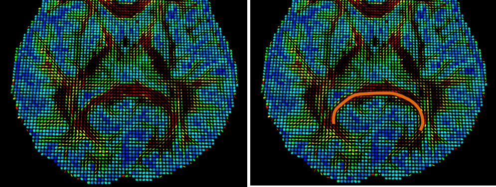

.. mrdiffusion documentation master file, created by
   sphinx-quickstart on Mon Oct 26 10:48:55 2015.
   You can adapt this file completely to your liking, but it should at least
   contain the root `toctree` directive.

------------------------
Data Processing Pipeline
------------------------

.. meta::
   :description: User Guide of Brainnetome DiffusionKit

.. toctree::
   :maxdepth: 3

Preprocessing
=============

A set of command line tools for data preprocessing steps is described in this section, 
which include data format conversion, eddy current correction and brain extraction.

.. _DICOM_to_NIFTI:

DICOM to NIFTI Conversion
-------------------------

For saving space of data store, the nii.gz format was used throughout the 
whole pipeline. Firstly, we use the 
dcm2nii (by Chris Rorden, https://www.nitrc.org/projects/dcm2nii) to convert the 
data into a single 3/4D .nii.gz volume-series file, plus bval and bvec files. 
The format of bval file is ::

 0 1500 1500 ... 1500

and the format of bvec file is ::

 0  0.99944484233856   0.00215385644697   0.00269041745923 ...
 0  -0.0053533311002   0.99836695194244   0.60518479347229 ...
 0  0.03288444131613  -0.05708565562963   -0.79608047008514 ...

where the 0 in the first column indicates the b0 images in the scan and 
certainly the software also supports multi-b0 images. 
Since the DICOM formats from different scanner might be different, 
this function is not always able to successfully extract the bvec/bval files. 
If you encounter such a problem, please get back to us <link> and 
give the link of your data if it has big size beyond the email capability. 

.. code-block:: bash

  $ ./dcm2nii -h
  Compression will be faster with /usr/local/bin/pigz
  Chris Rorden's dcm2niiX version 24Nov2014
  usage: dcm2nii [options] <in_folder>
  Options :

   -h   show help
   -f   filename (%c=comments %f=folder name %p=protocol %i ID of 
        patient %n=name of patient %s=series, %t=time; default 'DTI')
   -o   output directory (omit to save to input folder)
   -z   gz compress images (y/n, default n)

  Defaults file : /home/ccm/.dcm2nii.ini
  Examples :
  dcm2nii /Users/chris/dir
  dcm2nii -o /users/cr/outdir/ -z y ~/dicomdir
  dcm2nii -f mystudy%s ~/dicomdir
  dcm2nii -o "~/dir with spaces/dir" ~/dicomdir
  Example output filename: '/DTI.nii.gz'

.. _Eddy_Current_Correction:

Eddy and motion correction
--------------------------

During the MRI scanning, many factors can cause magnetic field inhomogeneity,
including changing magnetic fields from the imaging gradients and the radiofrequency 
(RF) coils and yielded biological effects. These effects usually degrade 
the imaging quality, resulting in artifacts including shearing and blurring 
(http://mri-q.com/eddy-current-problems.html). 
Another type of artifacts is caused by head motion. Most of the artifacts 
described above could be amended by post-processing. In the eddy correction 
module, we apply a affine registration method to address most of the shearing 
and motion artifacts. For the blurring artifacts, it still needs further 
investigation. Additional solutions would be added to reduce the magnetic 
field inhomogeneity by field mapping.

.. code-block:: bash

 $ ./bneddy -h
 bneddy: Head Motion Correction. 
    -i                Input file.
    -o                Output file.
    -ref     0        Reference image.
    -omp     2        Max number of threads.

Skull Stripping (Brain Extraction)
----------------------------------

This module is to strip the brain skull and extract the brain tissue, including 
gray matter, white matter, cerebrospinal fluid (CSF) and cerebellum. It 
largely benefits the following processing and analysis, offering better 
registration/alignment results and reducing computational time by excluding 
non-brain tissue. Therefore, although this step is not compulsory, we strongly 
recommend enforcing it. This module is adapted from the FSL/BET functions 
(http://fsl.fmrib.ox.ac.uk/fsl/fslwiki/BET) for its excellent efficacy and efficiency. 

.. code-block:: bash

 $ ./bet2 -h
 Part of FSL (build 504)
 BET (Brain Extraction Tool) v2.1 - FMRIB Analysis Group, Oxford
 Usage: 
 bet2 <input_fileroot> <output_fileroot> [options]
 Optional arguments (You may optionally specify one or more of):
	-o,--outline	generate brain surface outline overlaid onto original image
	-m,--mask <m>	generate binary brain mask
	-s,--skull	generate approximate skull image
	-n,--nooutput	don't generate segmented brain image output
	-f <f>		fractional intensity threshold (0->1); default=0.5; smaller values give larger brain outline estimates
	-g <g>		vertical gradient in fractional intensity threshold (-1->1); default=0; positive values give larger brain outline at bottom, smaller at top
	-r,--radius <r>	head radius (mm not voxels); initial surface sphere is set to half of this
	-w,--smooth <r>	smoothness factor; default=1; values smaller than 1 produce more detailed brain surface, values larger than one produce smoother, less detailed surface
	-c <x y z>	centre-of-gravity (voxels not mm) of initial mesh surface.
	-t,--threshold	-apply thresholding to segmented brain image and mask
	-e,--mesh	generates brain surface as mesh in vtk format
	-v,--verbose	switch on diagnostic messages
	-h,--help	displays this help, then exits

.. _Reconstruction:

Reconstruction of the diffusion model
=====================================

The reconstruction for diffusion model within pixels is one of the key topics 
in diffusion MRI research and it is also one of key modules of the software.
At the current stage, we have integrated three modeling methods: one is 
the traditional Gaussian model (commonly known as DTI, diffusion tensor 
imaging), and the other two are for high angular resolution diffusion imaging 
(HARDI). For more detailed information please refer to our review paper 
`[11] <reference.html#id11>`_ and `[13] <reference.html#id13>`_ .

.. _DTI_Reconstruction:

DTI Reconstruction
------------------

The classical diffusion gradient sequence used in dMRI is the pulsed gradient 
spin-echo (PGSE) sequence proposed by Stejskal and Tanner. This sequence 
has 90o and 180o gradient pulses with duration time δ and separation time Δ. 
To eliminate the dependence of spin density, we need at least two measurements 
of diffusion weighted imaging (DWI) signals, i.e. S(b) with the diffusion 
weighting factor b in Eq. (1) introduced by Le Bihan etc, and S(0) with 
b = 0 which is the baseline signal without any gradient. 

.. raw:: html

 $$ \begin{equation}\tag{1}
 b=\gamma^2 \delta^2 (\Delta-\frac{\delta}{3}){||\bf{G}||}^2
 \end{equation} $$

In the b-value in Eq. (1), $\\gamma$ is the proton gyromagnetic ratio, 
$\\bf{G}=||\\bf{G}||\\bf{u}$ is the diffusion sensitizing gradient pulse 
with norm $||{\\bf G}||$ and direction ${\\bf u}$. $\\tau=\\Delta-\\frac{1}{3}\\delta$ 
is normally used to describe the effective diffusion time. Using the PGSE 
sequence with S(b), the diffusion weighted signal attenuation E(b) is given 
by Stejskal-Tanner equation,

.. raw:: html

 $$ \begin{equation}\tag{2}
 E(b)=\frac{S({b})}{S(0)}=\exp(-{b}D)
 \end{equation} $$

where D is known as the apparent diffusion coefficient (ADC) which reflects 
the property of surrounding tissues. Note that in general ADC D is also 
dependent on G in a complex way. However, free diffusion in DTI assumes 
D is only dependent on the direction of G, i.e. . The early works in dMRI 
reported that ADC D is dependent on gradient direction u and used two or 
three DWI images in different directions to detect the properties of tissues.
Then Basser et al. introduced diffusion tensor `[12] <reference.html#id12>`_ to 
represent ADC as $D(\\bf{u}) = {\\bf u^{T}}{\\bf D}\\bf{u}$, where ${\\bf D}$ 
is called as the diffusion tensor, which is a 3 × 3 symmetric positive defi
nite matrix independent of u. This method is called as diffusion tensor 
imaging (DTI) and is the most common method nowadays in dMRI technique. In 
DTI, the signal E(b) is represented as 

.. raw:: html

 $$ \begin{equation}\tag{3}
 E(b)=\exp(-b{\bf u^{T}}{\bf D}\bf{u})
 \end{equation} $$

.. figure:: images/scalarmaps.png
   :width: 800 px
   :alt: Tensor field and the scalar maps
   :align: center

   Figure 4. Tensor field and the scalar maps estimated from a monkey data with b = 1500s/mm2.

The diffusion tensor D can be estimated from measured diffusion signal samples 
through a simple least square method or weighted least square 
method `[12] <reference.html#id12>`_, or more complex methods that consider 
positive definite constraint or Rician noise. If single b-value is used, the 
optimal b-value for tensor estimation was reported to in the range of $(0.7\sim 1.5) \times 10^{-3} s/mm^2$ , 
and normally about twenty DWI images are used in DTI in clinical study. ome 
useful indices can be obtained from tensor D. The most important three indices 
are fractional anisotropy (FA), mean diffusivity (MD) and relative anisotropy (RA) defined as 

.. raw:: html

 $$ \begin{equation}\tag{4}
 {\rm{FA}}=\frac{\sqrt{3}||{\rm{D}}-\frac{1}{3} \rm{trace} ({\rm{D}}) I ||}{\sqrt{2}||{\rm{D}}||}
 =\sqrt{\frac{3}{2}}\sqrt{\frac{(\lambda_1-\bar{\lambda})^2+(\lambda_2-\bar{\lambda})^2+(\lambda_3-\bar{ \lambda})^2}{\lambda_{1}^{2}+\lambda_{2}^{2}+\lambda_{3}^{2}}}
 \end{equation} $$

.. raw:: html
 
 $$ \begin{equation}\tag{5}
 {\rm{MD}}=\bar{\lambda}=\frac{1}{3} \rm{trace} ({\rm{D}})=\frac{\lambda_1+\lambda_2+\lambda_3}{3}
 \end{equation} $$ 

.. raw:: html
 
 $$ \begin{equation}\tag{6}
 {\rm{RA}}=\sqrt{\frac{(\lambda_1-\bar{\lambda})^2+(\lambda_2-\bar{\lambda})^2+(\lambda_3-\bar{\lambda})^2}{3\bar{\lambda}}}
 \end{equation} $$ 

where,  are the three eigenvalues of D and  is the mean eigenvalue. MD and FA have been used in many clinical applications. For example, MD is known to be useful in stroke study. For more detailed information please refer to our review paper `[13] <reference.html#id13>`_.

.. code-block:: bash

 $ ./bndti_estimate -h
 bndti_estimate: Diffusion Tensors Estimation.
 DiffusionKit (v1.2), http://diffusion.brainnetome.org/. 
 (Oct  9 2015, 19:26:40)
 general arguments
    -d                Input DWI Data, in NIFTI/Analyze format (4D)
    -g                Gradients direction file
    -b                b value file
    -m                Brain mask : filein mask | OPTIONAL
    -o                Result DTI : fileout DTI
    -tensor  0        Save tensor : 0 - No; 1 - Yes; (Default: 0)
    -eig     0        Save eigenvalues and eigenvectors : 0 - No; 1 - Yes; (Default: 0)

.. _SPFI_Reconstruction:

SPFI Reconstruction
-------------------

It was proposed that the SPFI method has more powerful capability to identify 
the tangling fibers `[8] <reference.html#id8>`_. In SPFI `[8] <reference.html#id8>`_, 
the diffusion signal  is represented by spherical polar Fourier (SPF) basis functions in Eq. 7. 

.. raw:: html

 $$\begin{equation} \tag{7}
 E(q)=\prod_{n=0}^{N}\sum_{l=0}^{L}\sum_{m=-l}^{l} a_{lmn}R_{n}(||q||)Y_{l}^{m}(u)
 \end{equation}$$

The SPF basis denoted by $R_{n}(||q||)Y_{l}^{m}(u)$ is a 3D orthonormal basis with 
spherical harmonics in the spherical portion and the Gaussian-Laguerre function in 
the radial portion. Furthermore, Cheng and his colleagues proposed 
a uniform analytical solution to transform the coefficients $a_{lmn}$ of $E(q)$ 
to the coefficients $c_{lm}^{\\Phi_w}$ of ODF (orientation distribution function) 
represented by the spherical harmonics basis, as in Eq. 8. 

.. raw:: html

 $$\begin{equation} \tag{8}
 \Phi_w(r)=\sum_{l=0}^{L}\sum_{m=-l}^{l}c_{lm}^{\Phi_w}Y_{l}^{m}(r)
 \end{equation}$$

It is a model-free, regularized, fast and robust reconstruction method 
which can be performed with single-shell or multiple-shell HARDI data to 
estimate the ODF proposed by Wedeen et al. `[14] <reference.html#id14>`_. 
The implementation of analytical SPFI includes two independent steps. 
The first estimates the coefficients of $E(q)$ with least squares, 
and the second transforms the coefficients of $E(q)$ to the coefficients of ODF.

.. code-block:: bash

  $ bnhardi_ODF_estimate -h
  bnhardi_ODF_estimate: Orientation Distribution Function Estimation (SPFI method).
  DiffusionKit (v1.2), http://diffusion.brainnetome.org/. 
  (Jul 15 2015, 11:50:20)
    -d                        dwi data
    -b                        text file contains b-value
    -g                        text file contains grad direction
    -m                        Brain mask.
    -o                        output odf file
    -scale           -1       if not given, a suggested scheme is used
    -tau             0.02533  tar value to calculate the true pdf.
    -outGFA          false    output GFA: true or false
    -rdis            0.015    r value for pdf.
    -sh              4        order of spherical harmonics
    -ra              1        order of radial part
    -lambda_sh       0        regualrization parameter for sh basis
    -lambda_ra       0        regualrization parameter for ra basis

.. _CSD_Reconstruction:

CSD Reconstruction
------------------

The CSD method was proposed by Tournier et al. `[9] <reference.html#id9>`_, which expresses the diffusion signal as in Eq. 9,

.. raw:: html

 $$\begin{equation} \tag{9}
 S(\theta,\Phi) = F(\theta,\Phi)\otimes R(\theta)
 \end{equation}$$

where $F(\\theta,\\Phi)$ is called the fiber orientation density function (fODF), 
which needs to be estimated, and $R(\\theta)$ is the response function, 
which is the typical signal generated from one fiber. 
The response function can be directly estimated from 
diffusion weighted image (DWI) data by measuring the diffusion profile 
in the voxels with the highest fractional anisotropy values, 
indicating that a single coherently oriented fiber population 
is contained in these voxels. When the response function is obtained, 
we can utilize the deconvolution of $R(\\theta)$ from $F(\\theta,\\Phi)$ 
to estimate the fiber ODF. The computation of the fiber ODF was carried out using the software 
MRtrix (J-D Tournier, Brain Research Institute, Melbourne, Australia, 
http://www.brain.org.au/software/). 
We thank Dr. Jacques-Donald Tournier for sharing MATLAB code of the CSD method, 
which inspired an efficient C/C++ implementation.

.. code-block:: bash

 $ ./bnhardi_FOD_estimate -h
 bnhardi_FOD_estimate: Constraind Spherical Deconvolution (CSD) based HARDI reconstruciton.
 DiffusionKit (v1.2), http://diffusion.brainnetome.org/. 
 (Jul 15 2015, 11:50:20)
 general arguments
    -d                            Input DWI Data, in NIFTI/Analyze format (4D)
    -g                            Gradients direction file
    -b                            b value file
    -m                            Brain mask : filein mask | OPTIONAL
    -outFA        1               Whether to output the FA of DTI
    -o                            Result CSD Estimate (.nii.gz)
    -lmax         8               6/8/10, Max order of the adopted harmonical base
    -fa           [0.75,0.95]     The FA thesshold considered as single fiber
    -erode        -1              The unit is voxel: Remove the garbage near the boundary of FA image, 
                                  for better estimating response function
    -nIter        50              Max iteration number before aborting
    -lambda       1               The regularization weight for optimization
    -tau          0.1             The threshold on the FOD amplitude used to identify negative lobes
    -hr           300             300/1000/5000. The later get more acurate estimation while more 
                                  time consuming, so use the first one unless your computer 
                                  is powerful !

.. _Fiber_Tracking:

Fiber tracking and attributes extraction
========================================

Fiber tracking is a critical way to construct the anatomical connectivity 
matrix. For the tracking based on tensors from DTI, an intuitive way is 
to link the neighboring voxels following their main directions (e.g. V1 
in the eigenvector of the DTI) given a set of some stop criteria, such as 
maximum bending angle of the curve and minimum FA value, which is to ensure 
the target voxel is indeed white matter microstructure. This is the so called 
deterministic streamline tractography `[15] <reference.html#id15>`_, as illustrated in Figure 5.

   Figure 5. Illustration for deterministic streamline tractography.

.. code-block:: bash

 $ ./bndti_tracking -h
 bndti_tracking: DTI Deterministic Fibertracking.
 DiffusionKit (v1.2), http://diffusion.brainnetome.org/. 
 (Oct  9 2015, 19:26:46)
    -d                   Input DTI data.
    -m                   Mask Image.
    -s                   Seeds Image.
    -fa                  FA Image.
    -ft        0.1       FA Threshold
    -at        45        Angular Threshold.
    -sl        0.5       Step Length (Voxel).
    -min       10        Threshold the fiber (mm). (remove fibers shorter than the number)
    -max       5000      Upper-threshold the fiber (mm). (remove fibers longer than the number)
    -o                   Output Fibers Filename (.trk file).

The tracking module in the software for HARDI estimation is similar to the 
streamline method as described above. It should be kept in mind that, for 
HARDI estimation, usually there are more than one main direction (which 
is what we desired since it possibly identifies tangling fibers), so we 
should consider these kissing/branching cases. Meanwhile, since there is 
no explicit dominant directions for each voxel, searching algorithm should 
be applied to locate the main directions. The searching should run for each 
voxel, so it is not as fast as the traditional DTI tracking.

.. code-block:: bash

 $ ./bnhardi_tracking -h
 bnhardi_tracking: HARDI Deterministic Fibertracking.
 DiffusionKit (v1.2), http://diffusion.brainnetome.org/. 
 (Oct  9 2015, 19:26:46)
   -d                HARDI spherical harmonic image.
   -fa               Anisotropy image.
   -m                Mask file.
   -s                Seeds file.
   -o                Fiber file (.trk file).
   -sl     0.5       Step length (Voxel): float
   -ft     0.1       FA threshold: float
   -at     75        Angle threshold: float
   -min    10        Threshold the fiber (mm). (remove fibers shorter than the number)
   -max    5000      Upper-threshold the fiber (mm). (remove fibers longer than the number)

Visualization for various images
================================

The software provides a variety of entries for visualizing different data 
types, including 3D/4D image, Tensor/ODF/FOD image and white mater fibers.
The views of different data could be superimposed for a precise anatomical 
localization. It should be noted that, if one uses the GUI, these view functions 
could be called in each processing steps for inspecting the results. 

Figure 6. Illustrations for the capability of the software to show many types of images.

.. code-block:: bash

 $ ./bnviewer -h
 This program is the GUI frontend that displays and performs data reconstruction and fiber tracking on diffusion MR images, which have been developed by the teams of Brainnetome Center, CASIA.
 basic usage: 
   bnviewer [[-volume] DTI_FA.nii.gz] 
            [-roi ROI/roi_cc_top.nii.gz] 
            [-fiber ROI/roi_cc_top.trk] 
            [-tensor DTI.nii.gz]/[-odf HARDI.nii.gz]

 options:  
   -help                  show this help
   -volume  .nii.gz       set input background data
   -roi     .nii.gz       set input ROI data
   -fiber   .trk          set input fiber data
   -tensor  .nii.gz       set input DTI data (conflict with -odf args)
   -odf     .nii.gz       set input ODF/FOD data (conflict with -tensor args)

Several other useful tools
==========================

Image registration
------------------

This module is implemented by NiftyReg, which is an open-source software 
for efficient medical image registration. It has been mainly developed by 
members of the Translational Imaging Group with the Centre for Medical 
Image Computing at University College London, UK `[10] <reference.html#id10>`_. 
In our software, the registration module is customized to auto-configure 
the parameter settings for different image modalities, e.g., two DWI 
images (for eddy current correction in current version), standard space and T1 
space (for mapping ROIs to the individual space), DWI space and 
standard space (for statistical comparisons across subjects). This 
module contains several commands :code:`reg_aladin` is the command for 
rigid and affine registration which is based on a block-matching approach and 
a Trimmed Least Square (TLS) scheme `[18] <reference.html#id18>`_ 
`[19] <reference.html#id19>`_. :code:`reg_f3d` is the command to perform 
non-linear registration which is based on the Free-From Deformation presented 
by Rueckert et al. `[20] <reference.html#id20>`_. :code:`reg_resample` is 
been embedded in the package. It uses the output of :code:`reg_aladin` and 
:code:`reg_f3d` to apply transformation, generate deformation fields or 
Jacobian map images for example. 

.. code-block:: bash

 $ ./reg_aladin -h
 Block Matching algorithm for global registration.
 Based on Ourselin et al., "Reconstructing a 3D structure from serial histological sections", Image and Vision Computing, 2001
 
 Usage:	reg_aladin -ref <filename> -flo <filename> [OPTIONS].
	-ref <filename>	Reference image filename (also called Target or Fixed) (mandatory)
	-flo <filename>	Floating image filename (also called Source or moving) (mandatory)
 
 OPTIONS
	-noSym 			The symmetric version of the algorithm is used by default. Use this flag to disable it.
	-rigOnly		To perform a rigid registration only. (Rigid+affine by default)
	-affDirect		Directly optimize 12 DoF affine. (Default is rigid initially then affine)
	-aff <filename>		Filename which contains the output affine transformation. [outputAffine.txt]
	-inaff <filename>	Filename which contains an input affine transformation. (Affine*Reference=Floating) [none]
	-rmask <filename>	Filename of a mask image in the reference space.
	-fmask <filename>	Filename of a mask image in the floating space. (Only used when symmetric turned on)
	-res <filename>		Filename of the resampled image. [outputResult.nii]
	-maxit <int>		Maximal number of iterations of the trimmed least square approach to perform per level. [5]
	-ln <int>		Number of levels to use to generate the pyramids for the coarse-to-fine approach. [3]
	-lp <int>		Number of levels to use to run the registration once the pyramids have been created. [ln]
	-smooR <float>		Standard deviation in mm (voxel if negative) of the Gaussian kernel used to smooth the Reference image. [0]
	-smooF <float>		Standard deviation in mm (voxel if negative) of the Gaussian kernel used to smooth the Floating image. [0]
	-refLowThr <float>	Lower threshold value applied to the reference image. [0]
	-refUpThr <float>	Upper threshold value applied to the reference image. [0]
	-floLowThr <float>	Lower threshold value applied to the floating image. [0]
	-floUpThr <float>	Upper threshold value applied to the floating image. [0]
	-nac			Use the nifti header origin to initialise the transformation. (Image centres are used by default)
	-cog			Use the input masks centre of mass to initialise the transformation. (Image centres are used by default)
	-interp			Interpolation order to use internally to warp the floating image.
	-iso			Make floating and reference images isotropic if required.
	-pv <int>		Percentage of blocks to use in the optimisation scheme. [50]
	-pi <int>		Percentage of blocks to consider as inlier in the optimisation scheme. [50]
	-speeeeed		Go faster
	-omp <int>		Number of thread to use with OpenMP. [4]
	-voff			Turns verbose off [on]

.. code-block:: bash

 $ ./reg_f3d -h
 Fast Free-Form Deformation algorithm for non-rigid registration.
 Based on Modat et al., "Fast Free-Form Deformation using graphics processing units", CMPB, 2010
 
 Usage:	reg_f3d -ref <filename> -flo <filename> [OPTIONS].
	-ref <filename>	Filename of the reference image (mandatory)
	-flo <filename>	Filename of the floating image (mandatory)

 OPTIONS
 Initial transformation options (One option will be considered):
	-aff <filename>		Filename which contains an affine transformation (Affine*Reference=Floating)
	-incpp <filename>	Filename ofloatf control point grid input

 Output options:
	-cpp <filename>		Filename of control point grid [outputCPP.nii]
	-res <filename> 	Filename of the resampled image [outputResult.nii]

 Input image options:
	-rmask <filename>		Filename of a mask image in the reference space
	-smooR <float>			Smooth the reference image using the specified sigma (mm) [0]
	-smooF <float>			Smooth the floating image using the specified sigma (mm) [0]
	--rLwTh <float>			Lower threshold to apply to the reference image intensities [none]. Identical value for every timepoint.*
	--rUpTh <float>			Upper threshold to apply to the reference image intensities [none]. Identical value for every timepoint.*
	--fLwTh <float>			Lower threshold to apply to the floating image intensities [none]. Identical value for every timepoint.*
	--fUpTh <float>			Upper threshold to apply to the floating image intensities [none]. Identical value for every timepoint.*
	-rLwTh <timepoint> <float>	Lower threshold to apply to the reference image intensities [none]*
	-rUpTh <timepoint> <float>	Upper threshold to apply to the reference image intensities [none]*
	-fLwTh <timepoint> <float>	Lower threshold to apply to the floating image intensities [none]*
	-fUpTh <timepoint> <float>	Upper threshold to apply to the floating image intensities [none]*

 Spline options:
	-sx <float>		Final grid spacing along the x axis in mm (in voxel if negative value) [5 voxels]
	-sy <float>		Final grid spacing along the y axis in mm (in voxel if negative value) [sx value]
	-sz <float>		Final grid spacing along the z axis in mm (in voxel if negative value) [sx value]

 Regularisation options:
	-be <float>		Weight of the bending energy penalty term [0.005]
	-le <float> <float>	Weights of linear elasticity penalty term [0.0 0.0]
	-l2 <float>		Weights of L2 norm displacement penalty term [0.0]
	-jl <float>		Weight of log of the Jacobian determinant penalty term [0.0]
	-noAppJL		To not approximate the JL value only at the control point position

 Measure of similarity options:
 NMI with 64 bins is used expect if specified otherwise
	--nmi			NMI. Used NMI even when one or several other measures are specified.
	--rbn <int>		NMI. Number of bin to use for the reference image histogram. Identical value for every timepoint.
	--fbn <int>		NMI. Number of bin to use for the floating image histogram. Identical value for every timepoint.
	-rbn <tp> <int>		NMI. Number of bin to use for the reference image histogram for the specified time point.
	-rbn <tp> <int>		NMI. Number of bin to use for the floating image histogram for the specified time point.
	--lncc <float>		LNCC. Standard deviation of the Gaussian kernel. Identical value for every timepoint
	-lncc <tp> <float>	LNCC. Standard deviation of the Gaussian kernel for the specified timepoint
	--ssd			SSD. Used for all time points
	-ssd <tp>		SSD. Used for the specified timepoint
	--kld			KLD. Used for all time points
	-kld <tp>		KLD. Used for the specified timepoint
	-amc			To use the additive NMI for multichannel data (bivariate NMI by default)

 Optimisation options:
	-maxit <int>		Maximal number of iteration per level [300]
	-ln <int>		Number of level to perform [3]
	-lp <int>		Only perform the first levels [ln]
	-nopy			Do not use a pyramidal approach
	-noConj			To not use the conjuage gradient optimisation but a simple gradient ascent
	-pert <int>		To add perturbation step(s) after each optimisation scheme

 F3D2 options:
	-vel 			Use a velocity field integration to generate the deformation
	-fmask <filename>	Filename of a mask image in the floating space

 OpenMP-related options:
	-omp <int>		Number of thread to use with OpenMP. [4]

 Other options:
	-smoothGrad <float>	To smooth the metric derivative (in mm) [0]
	-pad <float>		Padding value [nan]
	-voff			To turn verbose off

.. code-block:: bash

 $ ./reg_resample -h
 Usage:	reg_resample -ref <filename> -flo <filename> [OPTIONS].
	-ref <filename>      Filename of the reference image (mandatory)
	-flo <filename>      Filename of the floating image (mandatory)

 OPTIONS
	-trans <filename>    Filename of the file containing the transformation parametrisation (from reg_aladin, reg_f3d or reg_transform)
	-res <filename>      Filename of the resampled image [none]
	-blank <filename>    Filename of the resampled blank grid [none]
	-inter <int>         Interpolation order (0, 1, 3, 4)[3] (0=NN, 1=LIN; 3=CUB, 4=SINC)
	-pad <int>           Interpolation padding value [0]
	-tensor              The last six timepoints of the floating image are considered to be tensor order as XX, XY, YY, XZ, YZ, ZZ [off]
	-psf                 Perform the resampling in two steps to resample an image to a lower resolution [off]
	-voff                Turns verbose off [on]

Need further help?
~~~~~~~~~~~~~~~~~~

Check the website http://cmictig.cs.ucl.ac.uk/wiki/index.php/NiftyReg.

Image calculation and ROI generation
------------------------------------

The module :code:`bncalc` provides simple image calculations, 
such as add/minus/multiply/divide operations. 
Meanwhile, it can also generate user-defined ROIs given 
the origin and radius in a user-specified image space.

.. code-block:: bash

 $ bncalc -h
 DiffusionKit (v1.2), http://diffusion.brainnetome.org/. 
 This funciton provide basic process for the input data (NIFTI/Analyze format)
 Usage of bncalc:
    -i       image         The original file you want to manage.
    -add     image/value   Add to the data from the last step.
    -sub     image/value   Subtract data from the last step.
    -mul     image/value   Multiply the data from the last step.
    -div     image/value   Divide the data from the last step.
    -roi     x,y,z,r       Generate a ROI centered at [x,y,z](MNI mm) with radius r,
                           in the input data space.
    -mask    image         Mask the data from last step by this input one. 
                           If this input is a binary, then it is the same as 
                           -mul, otherwise it keep the voxels from the last step 
                           when the new input is nonzero.
    -bin     value         set 1 if >value, otherwise 0. 
    -uthr    value         Set voxel=0 when it>=value. 
    -dthr    value         Set voxel=0 when it<=value. 
    -o       image         output a NIFTI (.nii.gz) file

Fiber manipulation
------------------

After obtaining a large bundle of white matter fibers, you may want to prune 
the fibers that go through specified locations (ROIs). Here, we provide 
several tools to manipulate the fiber bundles. :code:`bnfiber_prune`, to 
split fiber bundles based on given ROIs.

.. code-block:: bash

 bnfiber_prune: Merge or prune fiber bundles based on given ROIs.
 DiffusionKit (v1.2), http://diffusion.brainnetome.org/. 
 (Sep 17 2015, 14:47:12)
    -fiber                                    fiber file
    -and                                      AND file: ro1.nii.gz,roi2.nii.gz
    -or                                       OR file: roi1.nii.gz,roi2.nii.gz
    -not                                      NOT file: ro1.nii.gz,roi2.nii.gz
    -o                                        Output file (.trk file).

:code:`bnfiber_end`, to cut the fiber bundles given start/stop ROIs, which is useful 
to get the exact connections between two ROIs in constructing connectivity matrix.

.. code-block:: bash

 $ ./bnfiber_end -h
 bnfiber_end: Extract fibers which end in the two given rois.
 DiffusionKit (v1.2), http://diffusion.brainnetome.org/. 
 (Sep 17 2015, 14:47:12)
    -fiber                                    fiber file
    -roi1                                     roi1 file
    -roi2                                     roi2 file
    -o                                        Output file (.trk file)

:code:`bnfiber_stats`, to extract statistical properties of the fiber bundle, such 
as mean FA/MD and fiber numbers.

.. code-block:: bash

 $ ./bnfiber_stats -h
 bnfiber_stats: Show fiber stats.
 DiffusionKit (v1.2), http://diffusion.brainnetome.org/. 
 (Sep 17 2015, 14:47:12)
    -fiber                                    Input fiber file, then output mean FA/MD, number of fibers et al.

:code:`bnfiber_map`, to compute the fiber density map which is used in track density imaging `[16] <reference.html#id16>`_.

.. code-block:: bash

 $ ./bnfiber_map -h
 bnfiber_map: Calculate the fiber density according to the reference volume.
 DiffusionKit (v1.2), http://diffusion.brainnetome.org/. 
 (Sep 17 2015, 14:47:13)
    -fiber                                    Fiber file
    -ref                                      Reference file (NIfTI)
    -o                                        Output file (NIfTI).
    -nor             1                        Normalize fiber density: 1(yes) or 0(no).

:code:`bnmerge` / :code:`bnsplit`, to merge the 3D volumes to 4D or split 4D to 3D volumes.

.. code-block:: bash

 $ ./bnmerge -h
 bnmerge: Merge 3D NIfTI files  to 4D NIfTI file.
    This program is to merge 3D NIfTI files to 4D NIfTI file. 
    Usage: bnmerge filein1 filein2 ... fileout
    options:     -h           : show this help

.. code-block:: bash

 $ ./bnsplit -h
 bnsplit: Split 4D volume to 3D volumes.
    This program splits 4D volume to 3D volumes. 
    basic usage: split -i FILE_IN -o FILE_OUT prefix
    options:     -h           : show this help
                 -v LEVEL     : the verbose level to LEVEL

:code:`bninfo`, to display a short head information of the input image. Supported input image format includes NIFTI/DICOM.

.. code-block:: bash

 $ bninfo -h
 bninfo: Show file header information.
 DiffusionKit (v1.2), http://diffusion.brainnetome.org/. 
 (Jul 15 2015, 11:50:01)
    -i                                        Nifti/ANALYZE/DICOM file.

.. include:: common.txt

