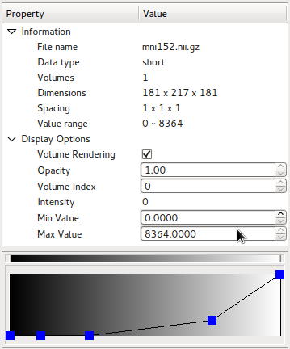
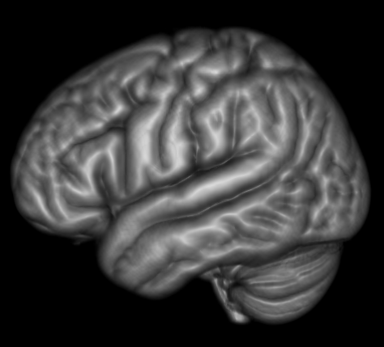

.. diffusionkit documentation master file, created by
   sphinx-quickstart on Mon Oct 26 10:48:55 2015.
   You can adapt this file completely to your liking, but it should at least
   contain the root `toctree` directive.

.. meta::
   :description: Tutorial on Diffusion Kit

.. toctree::
   :maxdepth: 3

-------------
Visualization
-------------

In this page, the general functionality implemented in the :code:`bnviewer` program is 
described in detail. This covers methods that a user can visualize almost all kinds of 
diffusion MRI data.

Except those specially noticed, all the data should be formatted in either NIFTI or 
ANAYLYZE image. NIFTI format is recommended, see :ref:`Data Format` page for more details. 

Command Line Interface
======================

Typing :code:`bnviewer -h` in command line would given following information, which
help users to load a list of files without click them one by one.
The can be extremely useful when one wants to contantly load a large list of data files
to get screen capture images.

.. code-block:: bash

 basic uage: 
   bnviewer [[-volume] DTI_FA.nii.gz] 
            [-roi ROI/roi_cc_top.nii.gz] 
            [-fiber ROI/roi_cc_top.fiber] 
            [-tensor DTI.nii.gz]/[-odf HARDI.nii.gz]
            [-atlas DTI.nii.gz]

 options:  
   -help                  show this help
   -volume  .nii.gz       set input background data
   -roi     .nii.gz       set input ROI data
   -fiber   .fiber/.trk   set input fiber data
   -tensor  .nii.gz       set input DTI data (conflict with -odf args)
   -odf     .nii.gz       set input ODF/FOD data (conflict with -tensor args)

.. todo:: 
  create interface for generating high quality images and save them into specified location.

Image Data Navigation
=====================

3D Navigation
-------------

When an image data is loaded, one can change view angle by dragging *left* mouse button.
This is the default interactor style implemented in `vtkInteractorStyleTrackballCamera`,
which is used internally in our program. According to VTK's documentation:

 vtkInteractorStyleTrackballCamera allows the user to interactively manipulate 
 (rotate, pan, etc.) the camera, the viewpoint of the scene. 
 In trackball interaction, the magnitude of the mouse motion is proportional 
 to the camera motion associated with a particular mouse binding. 
 For example, small left-button motions cause small changes in the rotation of 
 the camera around its focal point. For a 3-button mouse, the left button 
 is for *rotation*, the right button for *zooming*, 
 the middle button for *panning* (translation), 
 and ctrl + left button for *spinning*. (With fewer mouse buttons, 
 ctrl + shift + left button is for zooming, and shift + left button is for panning.)

We simplify the trackball interaction to used middle button for both panning and zooming, 
in order to spare right mouse click to popup option menu for more actions.

The **Background Color** for 3D view is defined as black by default.
This can be changed from option menu popped up when *right* mouse click event is captured. 
By selecting the color from the popup color dialog, the background color is changed instantly.

2D Navigation
-------------

Three 2D slice image views are placed below 3D view by default.
The three slice views from left to right are *sagittal plane, coronal plane* and 
*axial plane* respectively.

.. figure:: images/view_slice2d.png
   :width: 420
   :align: center
   
   *sagittal plane, coronal plane* and *axial plane* (left to right)

2D slice view widget sizes can be enlarged by switching the overall layout.
This functionality is implemented in a single button, named **Switch Layout**, 
available on the toolbar. By toggling the button, the main view panels switches 
between 3D view port and a combination of sliced 2d views.

.. figure:: images/view_slices.png
   :width: 300
   :align: center

Image slice index can be changed by clicking on 2d image slice views.
Besides, we perform radiological/neurological (or RAS/LAS) conversion intantly when slice index 
values are changed. 

For people interested in more details about the radiological/neurological conversion, 
please refer to FSL's `Orientation Explained 
<http://fsl.fmrib.ox.ac.uk/fsl/fslwiki/Orientation%20Explained>`_ .

Background Volume Data Layer
============================

Beginning from this section, several kinds of 'layers' are described. 
Each 'layer' may be contrain one or more data that holds the same property.
By default, the layers manager is located at top-right side of the window.

.. figure:: images/overlaymgr.png
  :width: 300
  :align: center

  The layers manager

We refer to *Background* data as plain 3D or 4D volume data that user wants to visualize
its sliced views. 
The content should be either a typical 3D image (e.g. T1/T2 image) or a 4D image 
such as DWI, DTI, ODF and even fMRI data.

To load a Background Data, click **Load Background** in the menu or toolbar, 
and select a single volume image. 
Note that selecting multiple image is not valid here, because the program 
doesn't aware which background image is laid that the bottom that might be 
overlaid by subsequently loaded images.

Once background image is loaded, several basic data information is shown in the
data property panel.

  property panel showing mni152 as background image
  

Image Contrast Enhancement
--------------------------

During loading a Background image, the minimum and maximum intensity values are
calculated and displayed in the data property panel.
By narrow down the range of image intensity values, one can the enhance image contrast.

Note that this functionality is currently applied for 2d sliced views only.

Volume Image Overlay
--------------------

By loading multiple image throught **Load Background** menu, one can 
This enables the user to make slice to slice comparison to find out image registration errors.

Volume Rendering
----------------

Volume rendering of the background image can be enabled in *Data Property* panel.
Once volume rendering is enabled, a color table is shown to enable users to adjust
color map and opacity values that maps intensity values onto visible planes.
This functionality is particularly useful for visualizing skull-stripped T1 image,
where the folds that increase the surface area of the cortex can be 
directly visible without threshold-based surface extraction.

  
  volume rendering of mni152 data

Region of Interest (ROI) Layer
==============================

To describe the location of a specific region, we employ the ROI layer. 
It outlines surface of the region on 3d view, along with a filled area on 2d slice views.

.. todo:: 
  compute the voxel-level volume size of a region, as well as its size in millimeters
  (by multiplying spacing).

Once the image data is loaded

Besides, loading multiple ROI data that located within the same directory is allowed.
This saves 

Fiber Layer
===========

Tensor/ODF/FOD Layer
====================

Tensor Data Visualization
-------------------------

ODF/FOD Visualization
---------------------

Due to performance reasons, ODF/FOD is rendered in low resolution by default.
For researchers who need high-resolution images for publication quality results, an option in
the properties panel is provided.

.. 
 |odf_lowres| |odf_highres|
 .. note:: show comparison of low/high resolution rendering
 
.. include:: common.txt

